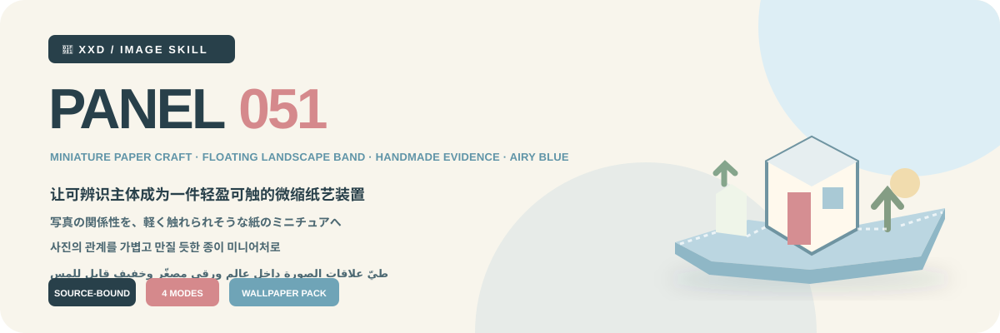
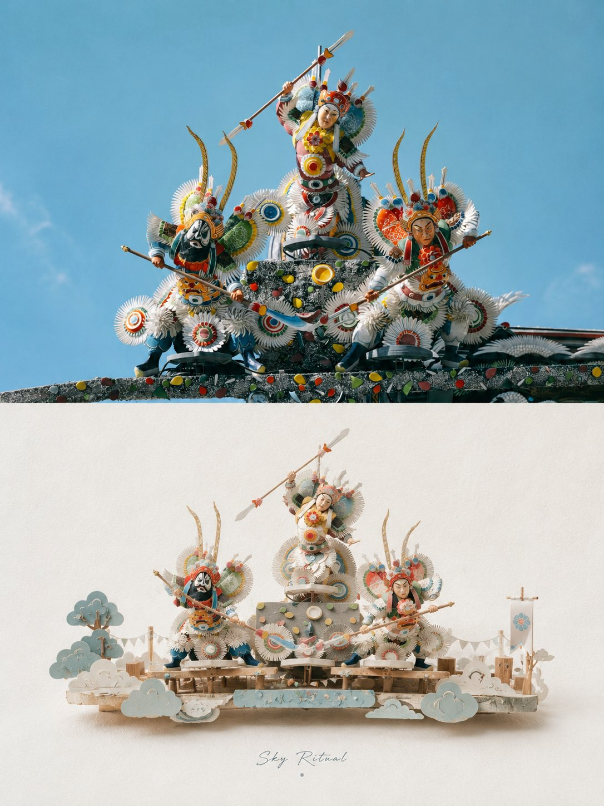
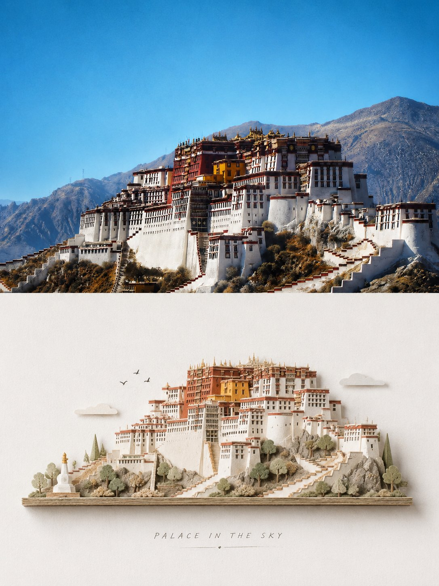
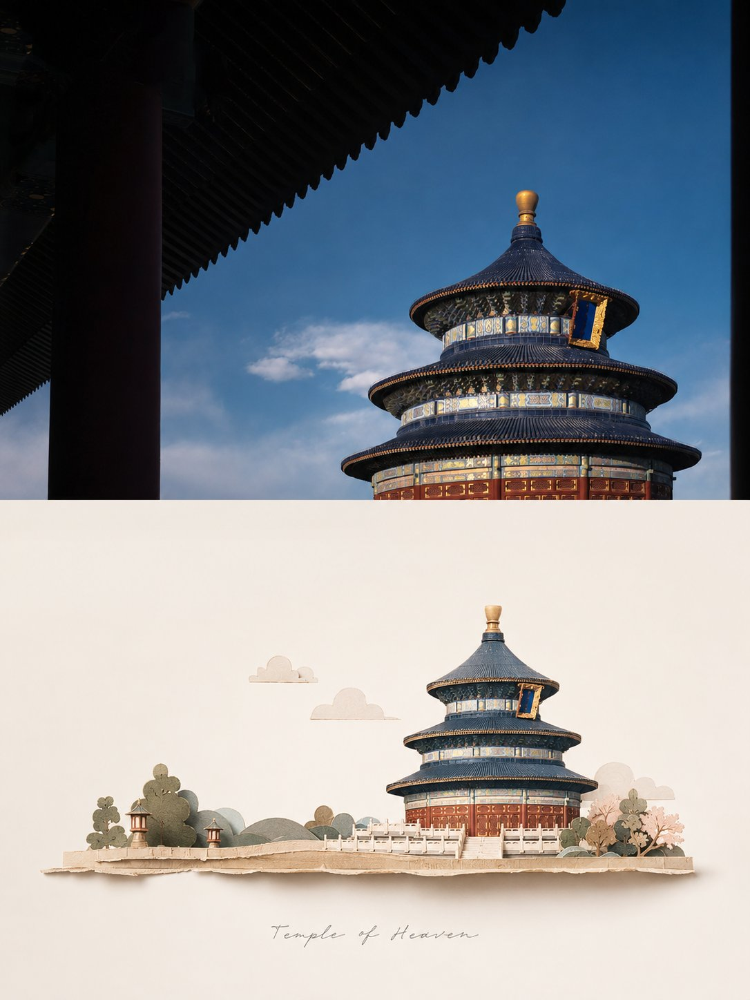
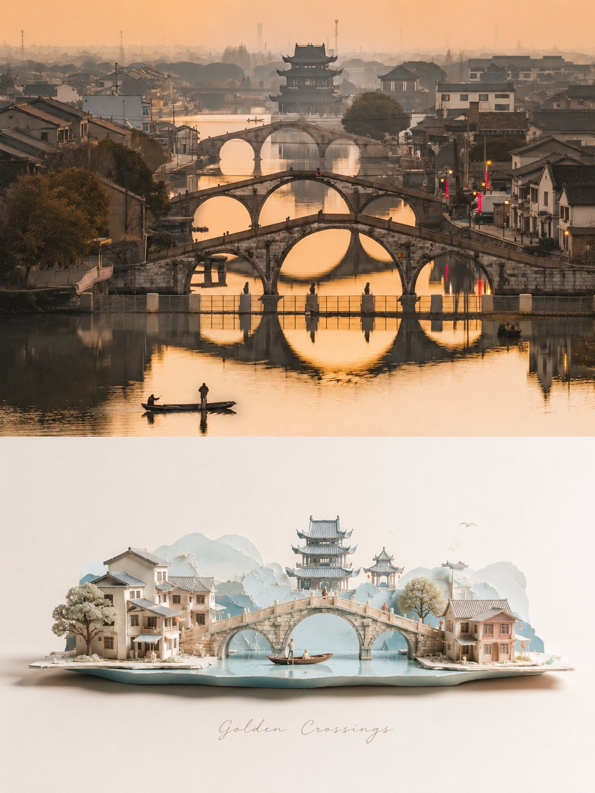

<p align="center"></p>

<div align="center">

# 🦁 XXD Panel 051

### 写真の関係性を、軽く触れられそうな紙のミニチュアへ

[](./SKILL.md)
[](#)
[](#)

<a href="README.md">简体中文</a> · <a href="README.en.md">English</a> · <strong>日本語</strong> · <a href="README.ko.md">한국어</a> · <a href="README.ar.md">العربية</a>

</div>

> ミニチュア紙工芸 · 横長の浮遊景観帯 · 手仕事の証拠 · エアリーブルー · 大きな余白

元写真の最も識別しやすい主題と物語的な関係を、手作りのミニチュア紙工芸へ変換します。見分けられる中心模型、細長く軽い横方向の景観帯、根拠のある少数の脇役模型、紙繊維、そして広い淡色紙面で構成します。

## 美的ロジック

```text
主題・輪郭・姿勢・物語関係を固定 → 固有の手掛かりを3つ残す → 識別できる手作りミニチュアを再構築 → 必要な脇役模型だけを抽出 → 細長い横方向の浮遊景観帯に配置 → 紙繊維・折り目・切り口・層の厚み・小さな誤差を見せる → 柔らかなマクロ光で体積を作る → 広い淡色紙面を残す → 文字を作品署名のように統合
```

無関係な写真へ差し替えても識別性、模型構造、素材選択、景観帯のリズム、配色、文案が変わらないなら、この Panel には属しません。

## ビジュアル契約

- 固有の手掛かりを最低3つ保ち、中心の手作り模型を一目で識別できるようにします。
- 一つの中心主題と細長い横方向の浮遊景観帯だけを作り、脇役模型は元写真に根拠を持たせて小さく静かにします。
- 尺度差、層状の遮蔽、小さな前景・背景で奥行きを作り、中央配置でも硬い左右対称や厚い台座を避けます。
- 紙繊維、折り端、切り口、層の厚み、毛羽、接合部、小さな制作誤差を、柔らかな拡散マクロ光の下で見せます。
- 空気感のある青を、アイボリー、クリーム、淡いベージュ、灰緑、セージ、建築的中間色で整えます。くすんだローズは小さな点だけです。
- プラスチックCG、玩具展示、幼い工作、汎用ジオラマ、過密、過度な可愛さ、EC商品展示、平面ベクター代用、濁りや黄ばみを拒否します。

完全仕様は [SKILL.md](SKILL.md) と [ランタイムアダプター](references/xxd-panel-051-prompt.en.md) を参照してください。原文の美的動機を守りつつ、歴史的な3:4画布を隠れた既定値にはしません。

## 作例 · X より

> [小小東（@xiaoxiaodong01）](https://x.com/xiaoxiaodong01/status/2091470045973262409) · 2026年8月23日<br>
> GPT2 × 切り紙 × 盆景 × 上質感 × 美学プロンプト × VOL.051

<table>
  <tr>
    <td width="50%"><a href="https://x.com/xiaoxiaodong01/status/2091470045973262409"></a></td>
    <td width="50%"><a href="https://x.com/xiaoxiaodong01/status/2091470045973262409"></a></td>
  </tr>
  <tr>
    <td width="50%"><a href="https://x.com/xiaoxiaodong01/status/2091470045973262409"></a></td>
    <td width="50%"><a href="https://x.com/xiaoxiaodong01/status/2091470045973262409"></a></td>
  </tr>
</table>

<p align="center"><a href="https://x.com/xiaoxiaodong01/status/2091470045973262409">元の投稿と完全なプロンプトを見る →</a></p>

これらの作例は 051 の美的意図を示すものであり、作例の被写体、構図、配色、コピー、旧キャンバス比率が生成時の参照や現在の既定値になることはありません。

## 原文プロンプトを唯一の美的基準にする

`references/051-source.md` が、このプロジェクト唯一の創作・美的基準です。Skill は原文を要約・拡張せず、共通の配色計画、美的動機、タイトル、マイクロコピーを追加しません。色、素材、構図、余白、言葉、タイポグラフィは、GPT Image 2 が原文プロンプトの規則どおりに実行します。

モードとサイズは、原文の変換美学を変えずに、旧来の 3:4 上下出力コンテナを完全に置き換えます。各成果物では選択された一つのモード契約だけを GPT Image 2 に送り、四つの候補を一つの汎用テンプレート内で解釈させません。

## 組み合わせ可能な4つの出力

`top-bottom`、`left-right`、`design-only`、`wallpaper-pack` は単独でも複数でも選べます。複数選択時も、各モードを独立したプロンプトで別々に生成します。

- `top-bottom`：現実画像を上、デザイン変換を下に置く一枚の完成キャンバス。
- `left-right`：上端から下端まで左右構造を保ち、元画像を左、デザインを右に配置します。文字もその構造内に統合し、幅は非対称でも構いません。
- `design-only`：元画像は不可視の参照に限定し、見える要素はすべて当該 Panel のデザイン変換言語に従います。
- `wallpaper-pack`：各端末用にデザイン変換のみの壁紙を独立再構成します。

境界線、中央比率、ピクセル座標は測定しません。決定論的な合成は、ユーザーが正確な分割または元写真のピクセル保持を明示した場合だけ使います。

通常サイズも複数選択できます：自動適応、元画像比率、1:1、3:4、4:3、4:5、5:4、2:3、3:2、9:16、16:9、21:9、5:7、7:5、カスタム比率／正確なピクセル。暗黙の既定サイズはありません。異なる比率は、同じ原文プロンプトから個別に再構成します。

壁紙セットは連動型または独立型。連動型は最初の一枚を基準画像とし、残りを元写真＋基準画像から各端末向けに再構成します。一枚を四サイズへ機械的に切り抜くことはありません。

## 文字モード

生成前に次の一つを選びます。

1. **原文プロンプトに従ってモデルが文字を生成**：ユーザーは言語・地域だけを指定し、内容、量、調子、組版は GPT Image 2 が原文どおりに生成します。表示される言葉は現在の画像の内容、空気感、または暗示から生まれ、事実・資料として見える情報には、ユーザー提供・画像内で確認可能・検証済みの根拠が必要です。
2. **自分の正確な文言を使う**：一字一句そのまま渡し、書き換え・翻訳・タイトル追加をしません。組版は原文に従います。
3. **文字なし**：文字と疑似文字を厳格に禁止します。

外側の Skill はタイトルやマイクロコピーを先に書きません。出力言語は操作言語と別に確認し、人物、風景、ファイル名から推測しません。

## 宿主能力に適応する質問とインライン引数

同じ Skill が、宿主に実在する対話機能へ適応します。装飾記号をクリック可能な UI のようには見せません。

- **Claude Code に `AskUserQuestion + multiSelect: true` がある場合**：モードとサイズは本物のチェックボックス、文字方式と壁紙関係は単一選択。一般サイズは正方形・縦・横のグループに分け、選択を累積し、カスタム値は自由入力します。
- **Codex に `request_user_input` しかない場合**：文字方式や壁紙関係など、相互排他的な項目だけに使います。モードやサイズを単一選択に見せかけず、組み合わせ入力で受け取ります。
- **対話ツールがない場合**：1回目にモード、2回目にサイズ＋文字方式を入力します。偽の `- [ ]` は表示せず、フォームのためだけに Plan mode への切り替えも求めません。

2回目は最初に「自動推薦／元画像比率／一般比率／カスタム」だけを表示します。一般比率を選んだときだけ、正方形 `1:1`、縦 `3:4、4:5、2:3、9:16、5:7`、横 `4:3、5:4、3:2、16:9、21:9、7:5` を展開します。複数比率と正確なピクセルを指定できます。

すべての設定はインラインでも指定できます。

```text
/xxd-panel-051 photo.jpg --mode top-bottom,design-only --size auto,3:4,9:16 --text prompt --locale ja-JP
```

`--mode`、複数指定可能な `--size`、`--text prompt|exact|none`、`--locale`、`--copy`、`--wallpaper linked|independent`、`--wallpaper-size`、`--out` に対応します。必要な値が揃っていれば質問を省略し、不足分だけを尋ねます。

## 画像モデルの優先順位

GPT Image 2 を既定の第一候補とします。高忠実度の参照画像、生成前の完成キャンバス確認、二連モードの完成画面一括生成、条件を満たした場合だけのスクリプト合成という既存の流れは変わりません。

現在のツールまたは設定済み経路から実際に利用でき、元画像の忠実度、完成画角、対象言語の文字、連動壁紙の複数参照を満たせる場合は、Seedance 5.0 Pro、Nano Banana Pro（Gemini Image Pro）、Nano Banana 2（Gemini Image Flash）、その他の互換ビットマップモデルも利用できます。代替モデルが変更できるのは生成経路だけで、モード、画角、文案、言語、壁紙関係、完成キャンバス優先の方針は変更できません。

適切な経路がない場合は、画像生成ツールを有効にするか API Key を提供するようユーザーに案内します。ユーザーが提供した認証情報は現在のタスクで利用できますが、返信やログに再表示・記録・開示しません。明示的な依頼がない限り、長期保存やプロバイダー、アカウント、課金、グローバル経路の設定変更も行いません。

## 使い始める

```bash
git clone https://github.com/nevertoday/xxd-panel-051.git
mkdir -p ~/.codex/skills
ln -s "$(pwd)/xxd-panel-051" ~/.codex/skills/xxd-panel-051
```

Claude Code では同じフォルダを `~/.claude/skills/xxd-panel-051` にリンクできます。インストール後にセッションを再起動してください。

完全仕様：[Skill](SKILL.md) · [原始資料](references/051-source.md) · [英語ランタイムアダプター](references/xxd-panel-051-prompt.en.md) · [中国語ランタイムアダプター](references/xxd-panel-051-prompt.zh-CN.md)

## XXD とサポート

XXD は小小東のブランド名の略称です。作者：[@xiaoxiaodong01](https://x.com/xiaoxiaodong01)。個別相談は299元／時間、Skills ユーザー交流グループは一回払い99元です。Knowledge Planet＋会員プロンプトライブラリは年額699元の一回の支払いで両方を利用できます。[Knowledge Planet](https://wx.zsxq.com/group/15554814142882) から加入した場合は WeChat で小小東に連絡して[プロンプトライブラリ](https://vip.xiaoxiaodong.ai/)の引換コードを受け取り、プロンプトライブラリで自動開通した場合は WeChat で連絡して Knowledge Planet への招待を受けてください。[WeChat](https://xiaoxiaodong.pages.dev/assets/wechat-qr.png)

<p align="center"><a href="https://xiaoxiaodong.pages.dev/assets/wechat-qr.png"></a></p>

<div align="center"><strong>写真を玩具にするのではなく、その本当の関係を紙へ折り込む。</strong></div>

---

<div align="center">

## ☕ オープンソースを支援

支援は任意で、プロジェクトへのアクセス条件を変えません。

<p align="center"><a href="https://github.com/nevertoday/zhongguo-traditional-colors/blob/main/docs/images/buy-me-a-coffee-qr.png?raw=true"></a></p>

</div>
